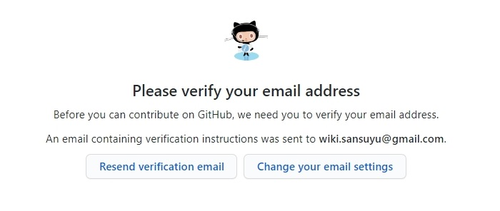

# 깃허브에 위키 만들기 - 2

## [GitHub.com](https://github.com/) 가입하기
Github 계정부터 만들어봅시다. [GitHub.com](https://github.com/)으로 접속하겠습니다.

{: width="50%" height="50%"}

평범한 회원가입 양식입니다. `username`이 `sansuyu`라면 저희가 만들 위키의 도메인은 `https://sansuyu.github.io/`가 됩니다. 이 점에 유의해주시고 양식을 작성해주세요. 다 작성하셨으면 `Sign up for GitHub`를 눌러봅시다.

{: width="35%" height="35%"}

`Verify your account`를 통해 간단한 인증 절차를 마치구요. `Join a free plan`을 눌러볼게요.

{: width="35%" height="35%"}

간단한 설문조사가 나오는데 GitHub Pages를 이용할 것이므로 위 항목은 체크하겠습니다. 그리고 `Complete setup`을 눌러볼게요.

{: width="35%" height="35%"}

이메일 인증을 해줍시다.

{: width="50%" height="50%"}

가입이 끝났습니다. 위키를 바로 만드려면 `Create a repository`를 눌러 다음 단계로 넘어갑시다.

[이전](1000) [다음](1002) [대문](index)

