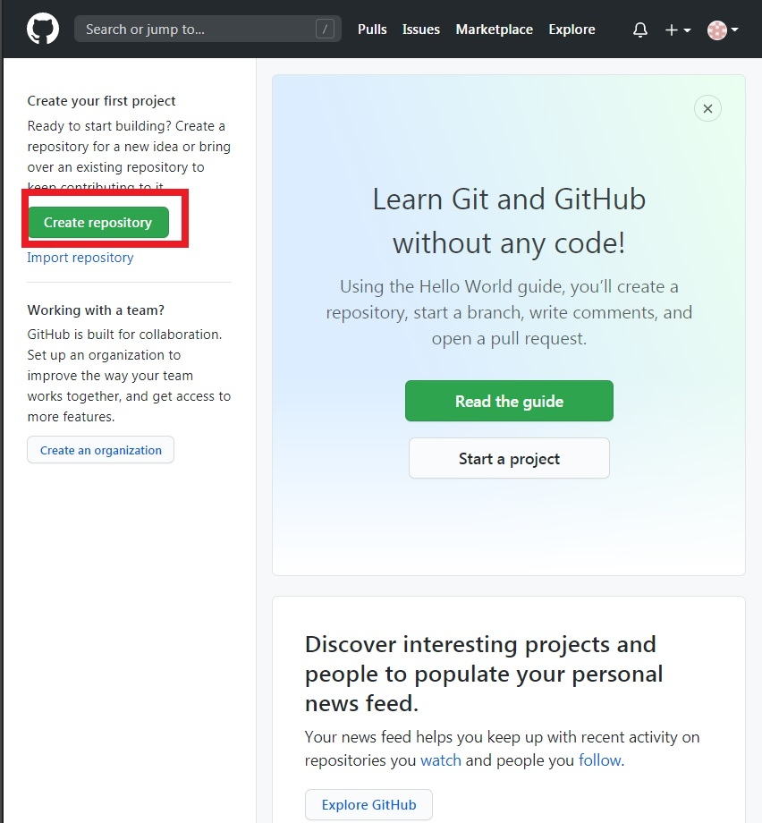
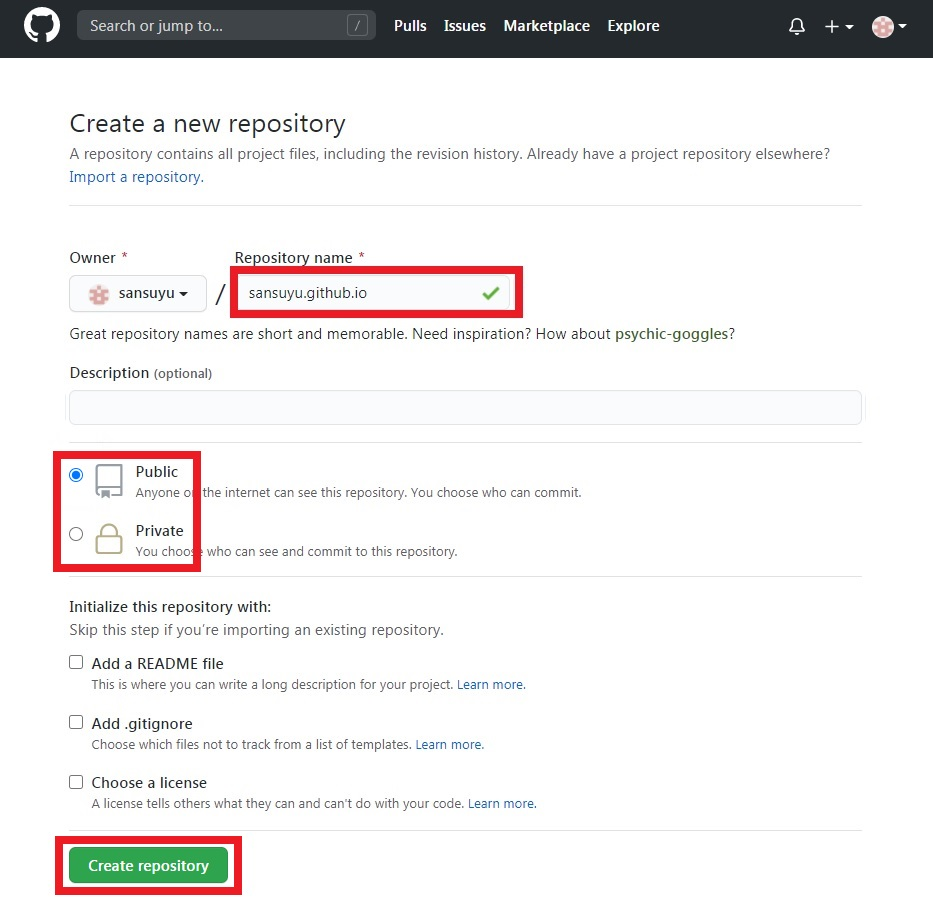
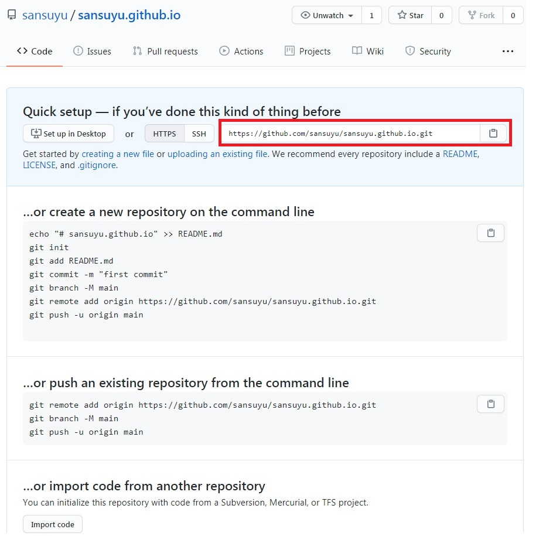

# 깃허브에 위키 만들기 - 3

## GitHub에 저장소 만들기

저장소를 만들고 GitHub Pages를 이용해 저장소를 위키로 활용해 봅시다. 깃허브 사이트 메인 좌측 상단의 `Create repository` 버튼을 누르겠습니다.

설정에 특별한건 없습니다만 저장소의 이름을 `username.github.io`로 만들어주세요. 그렇게 해야 저희가 만들 위키의 주소가 `username.github.io`가 됩니다. 저장소 이름을 꼭 사진과 같은 방식으로 작성해주세요. 그 다음 위키를 누구나 볼 수 있게 하려면 `public`, 개인적인 위키로 만들고 싶다면 `private`에 체크하고 `Create repository` 버튼을 눌러 완료합시다.

위와 같이 나오면 정상적으로 저장소가 만들어진 것입니다. 아직 `git`을 설치하지 않으셨다면 [#깃허브에 위키 만들기 - git 설치하기](1003)으로 이동해주세요. `git`을 이미 설치하셨다면 빨간 부분에 있는 주소를 복사해주세요.

복사한 원격 저장소의 주소를 git을 통해 로컬 저장소로 복제하겠습니다. 터미널에서 `git clone <복사한 주소>`를 입력하거나 깃 클라이언트를 통해 로컬 저장소에 복제합니다. 이 명령을 통해 깃허브 상의 `원격 저장소`를 복제해서 `로컬 저장소`를 만들고 둘을 연결하게 됩니다.