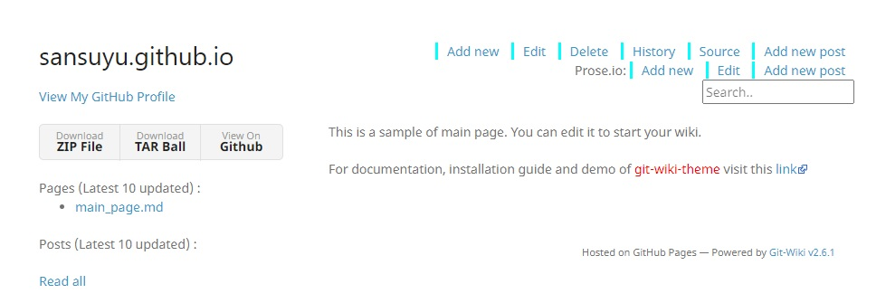

# Github Pages + Jekyll + git-wiki-theme를 이용한 위키 만들기

[git-wiki-theme](https://github.com/drassil/git-wiki-theme)에 들어갑니다. `Use this template` 버튼을 클릭. repository 명은 `<username>.github.io`로 만듭니다. 이미 GitHub Pages를 사용하고 있다면 [GitHub Pages 브랜치 만들기](#) 항목을 참조해주세요. `Create repository from template`를 눌러 저장소를 만듭니다. 위키가 정상적으로 만들어졌는지 `<username>.github.io`에 접속해서 확인해주세요.

위와 같은 화면이 나오는지 버튼이나 기능이 제대로 작동하는지 확인해주세요. 원하는대로 위키를 꾸미기 위해 루트 폴더에 있는 `_config.yml`을 열어봅시다.

작성중